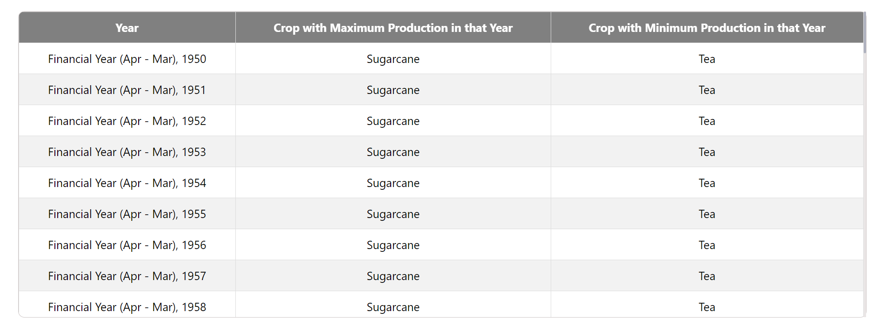
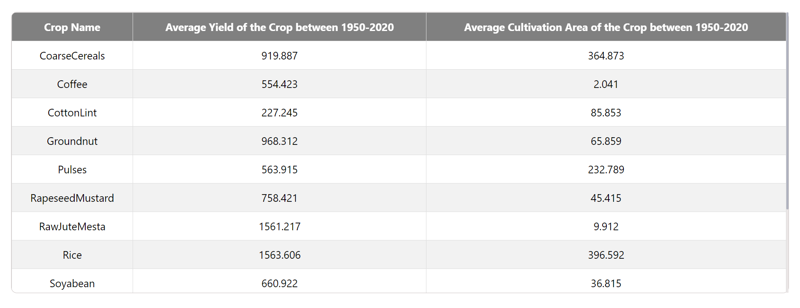

# My Agriculture Project

This project is focusing on data analysis of an Indian Agriculture dataset, Developed by using TypeScript/JavaScript, React.

"I did not used Mantine v7 for tables because its not supporting in CRA ( Create React App )".

## Table of Contents

- [Overview](#overview)
- [Screenshots](#screenshots)
- [Installation](#installation)
- [Usage](#usage)
- [Folder Structure](#folder-structure)
- [Technologies Used](#technologies-used)

## Overview

This project involves creating tables that display aggregated data from an Indian Agriculture dataset. Two tables are implemented:

1. **MaxMinProductionTable**: Displays crops with maximum and minimum production by year.
2. **AverageYieldAreaTable**: Displays average yield and cultivation area of crops between 1950-2020.

## Screenshots

1.Screenshot of first Table :


1.Screenshot of Second Table :


## Installation

1. Clone the repository:

   ```bash
   git clone https://github.com/thefarhanahmad/Agriculture-Data-Analysis-Project.git

   cd your-repository
   ```

2. Install dependencies using Yarn:

```bash
yarn install
```

## Usage

1.To start the project, run:

```bash

yarn start

```

## Technologies Used

1.ReactJS
2.TypeScript/JavaScript
3.Yarn
4.CSS
5.Mantine v7 ( not available for CRA )

## Folder Structure

├── public/
├── src/
│ ├── components/
│ ├── utils/
│ ├── App.tsx
│ ├── index.tsx
│ └── ...
├── .gitignore
├── package.json
├── README.md
└── ...
